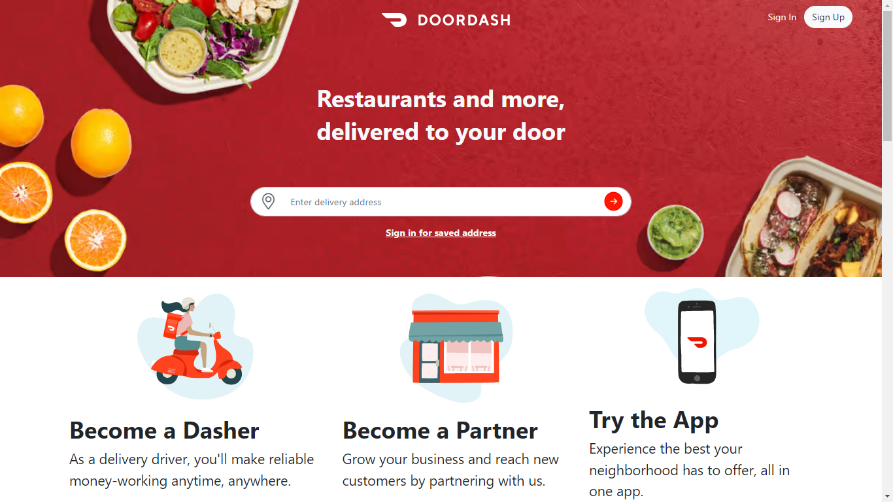

# 
 

## 
This is a single page that inspired from [doordash](https://www.doordash.com/) 

## 
Styled with bootstrap  

  

<pre><code> git clone https://github.com/omid-d94/doordash.git </code></pre>

- change directory to doordash

<pre><code> cd doordash </code></pre>

- install bootstrap from package.json

<pre><code> npm install </code></pre>

- serve the index file 

<pre><code> php -S 127.0.0.1:8888 </code></pre>

### [Click to show](http://127.0.0.1:8888/)

### Screenshots:

  
  
  

